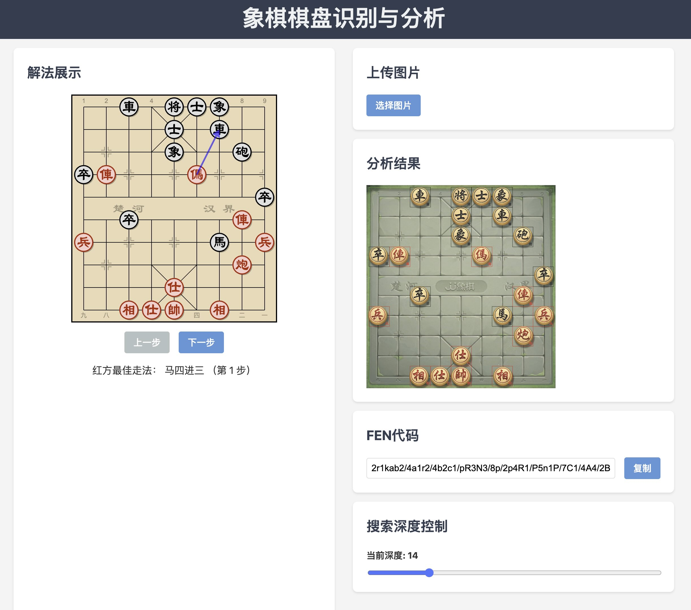

# 象棋棋盘识别与分析系统

这是一个在线象棋棋盘识别与分析系统，可以从上传的图片中识别出象棋棋局，并提供最佳走法分析。

PC 端截图：



## 在线演示

您可以在这里体验本系统：[象棋棋盘识别与分析](https://ifwu.github.io/xiangqi-analysis/)

## 功能特点

- 棋盘识别：从上传的图片中自动识别象棋棋盘和棋子位置
- FEN 生成：根据识别结果生成 FEN（Forsyth–Edwards Notation）字符串
- 最佳走法分析：使用象棋引擎分析当前局面，给出最佳走法建议
- 走棋模拟：可以按照建议的最佳走法进行模拟，查看局面变化
- 中文走法表示：将走法转换为中文表示，方便理解
- 响应式设计：适配不同尺寸的设备屏幕

## 技术栈

- 前端框架：Preact
- 图像处理：OpenCV.js
- 象棋引擎：Pikafish（WebAssembly 版本）
- 构建工具：Vite
- 包管理器：pnpm
- 部署：GitHub Pages

## 本地开发

1. 克隆仓库：

```
git clone https://github.com/iFwu/xiangqi-analysis.git
cd xiangqi-analysis
```

2. 安装依赖：

```
pnpm install
```

3. 启动开发服务器：

```
pnpm dev
```

4. 在浏览器中打开 `http://localhost:5173` 查看应用

## 构建

```
pnpm build
```

注意：本项目使用 GitHub Actions 进行自动部署。每次推送到主分支时，都会触发构建和部署流程。

## 项目结构

- `src/`: 源代码目录
  - `components/`: React 组件
  - `chessboard/`: 棋盘识别和分析相关的模块
  - `chessEngine/`: 象棋引擎调用类
- `public/`: 静态资源目录
- `assets/`: 图片资源目录
- `vite.config.ts`: Vite 配置文件
- `.github/workflows/`: GitHub Actions 工作流配置

## 贡献

欢迎提交 Issues 和 Pull Requests 来改进这个项目！

## 许可证声明

本项目使用 MIT 许可证。

本项目使用了 [Pikafish](https://github.com/official-pikafish/Pikafish) 象棋引擎，该引擎采用 GNU General Public License v3.0 (GPL-3.0) 许可证。Pikafish 的版权归其原作者所有。

本项目仅调用 Pikafish 引擎，并未对其进行修改。使用本项目不要求您的应用程序遵守 GPL-3.0 许可证。但是，如果您计划重新分发包含 Pikafish 的完整应用程序，请确保遵守 GPL-3.0 许可证的相关规定，包括提供源代码访问和适当的许可声明。

完整的 GPL-3.0 许可证文本可在 [此处](https://www.gnu.org/licenses/gpl-3.0.en.html) 查看。

使用本项目时，请确保理解并遵守相关的许可条款。如有疑问，建议咨询法律专业人士。
